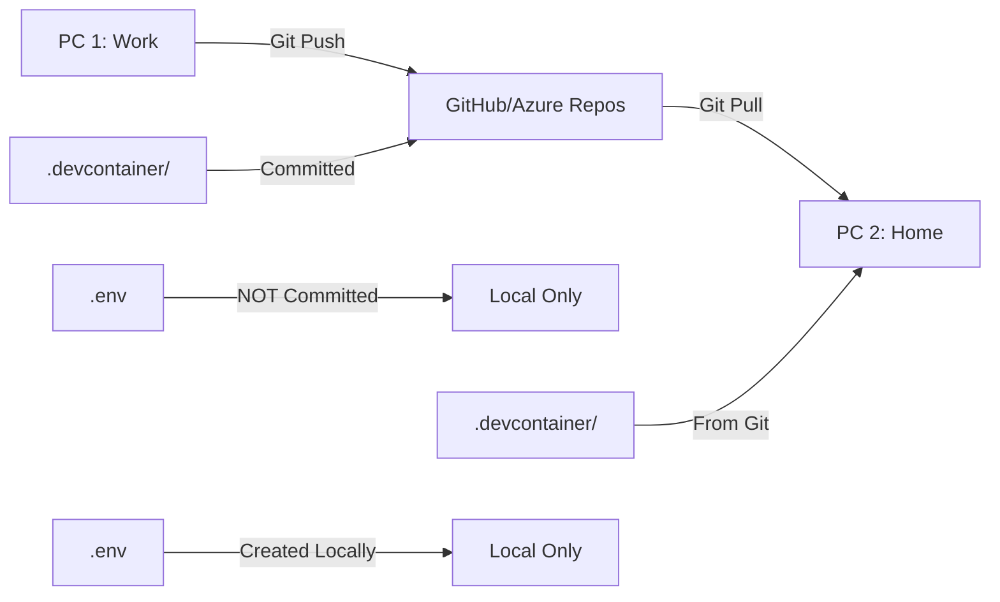

# DevContainer Templates - Multi-PC Development Environment

A comprehensive, portable DevContainer setup that preserves your VS Code configuration across multiple machines and projects. This template system allows you to maintain consistent development environments with all your extensions, settings, and tools, while keeping credentials secure and machine-specific.

## 🎯 Key Features

- **Full VS Code Integration**: All 45+ extensions from your current setup
- **Multi-Language Support**: Python, Node.js, PowerShell, and more
- **Cloud Ready**: Azure, Databricks, Docker, Kubernetes tools included
- **Configuration Persistence**: Settings travel with your project via Git
- **Machine-Specific Credentials**: Secure .env files (never committed)
- **State Capture Tool**: Save your current VS Code state before rebuilding
- **One-Command Deployment**: Deploy to any project in seconds

## 📁 Structure

```
DevContainerTemplates/
├── base-template/
│   └── .devcontainer/
│       ├── devcontainer.json          # Main configuration
│       ├── Dockerfile                 # Comprehensive dev image
│       ├── postCreateCommand.sh       # Auto-setup script
│       ├── capture-current-state.ps1  # State capture tool
│       ├── .env.example              # Environment template
│       └── .gitignore                # Security exclusions
├── deploy-to-project.ps1            # Deployment script
└── README.md                         # This file
```

## 🚀 Quick Start

### 1. Deploy to Your Project

```powershell
# From DevContainerTemplates directory
.\deploy-to-project.ps1 -ProjectPath "C:\YourProject"

# With options
.\deploy-to-project.ps1 -ProjectPath "C:\YourProject" -ExtensionProfile "data-science"
```

### 2. Configure Environment

Edit `.devcontainer/.env` in your project:

```bash
# Essential configurations
DATABRICKS_HOST=https://your-workspace.azuredatabricks.net
DATABRICKS_TOKEN=dapi-xxxxx
AZURE_TENANT_ID=your-tenant-id
```

### 3. Open in VS Code

```bash
code "C:\YourProject"
```

Then: `Ctrl+Shift+P` → "Dev Containers: Reopen in Container"

## 🔧 Configuration Management

### Environment Variables (.env)

Each machine needs its own `.env` file with machine-specific values:

**Work PC**: `.devcontainer/.env`
```bash
DATABRICKS_HOST=https://work.azuredatabricks.net
DATABRICKS_TOKEN=work-token
```

**Home PC**: `.devcontainer/.env`
```bash
DATABRICKS_HOST=https://personal.azuredatabricks.net
DATABRICKS_TOKEN=personal-token
```

### Settings Persistence

- **Non-sensitive settings** → In `devcontainer.json` (committed to Git)
- **Sensitive/machine-specific** → In `.env` file (git-ignored)
- **Workspace settings** → In `.vscode/settings.json` (committed)

## 📸 State Capture Tool

Before rebuilding your container, capture your current VS Code state:

```powershell
# Run from project root
.\.devcontainer\capture-current-state.ps1

# With options
.\.devcontainer\capture-current-state.ps1 -Verbose -IncludeUserSettings
```

This tool:
- ✅ Captures all installed extensions
- ✅ Saves workspace settings
- ✅ Records installed packages
- ✅ Updates devcontainer.json automatically
- ✅ Creates backup of original configuration

## 🔄 Multi-PC Workflow

### Initial Setup (PC #1)

1. Deploy template to project
2. Configure `.env` with local credentials
3. Commit `.devcontainer/` folder to Git (excluding .env)
4. Open in container

### Setup on Another PC (PC #2)

1. Clone/pull project from Git
2. Create `.env` from `.env.example`
3. Add machine-specific credentials
4. Open in container - everything works!

### Workflow



## 🎛 Extension Profiles

The deployment script supports different extension profiles:

- **full**: All 45+ extensions (default)
- **minimal**: Essential extensions only
- **data-science**: Python, Jupyter, Databricks
- **web**: Node.js, React, API development
- **custom**: Define your own

```powershell
.\deploy-to-project.ps1 -ExtensionProfile "minimal"
```

## 🔨 Included Tools

### Languages & Runtimes
- Python 3.11 (configurable)
- Node.js 18 LTS (configurable)
- PowerShell Core
- Bash/Zsh with Oh My Bash

### Cloud & DevOps
- Azure CLI
- Databricks CLI
- Docker & Docker Compose
- Kubernetes (kubectl)
- Terraform
- GitHub CLI

### Development Tools
- Git with credential helper
- Jupyter Lab & Notebooks
- Black, Flake8, PyLint (Python)
- ESLint, Prettier (JavaScript)
- Pre-commit hooks support

### Data Science Libraries
- NumPy, Pandas, Matplotlib
- Scikit-learn, SciPy
- Plotly, Seaborn
- Jupyter ecosystem

## 🛠 Customization

### Adding Project-Specific Tools

Create `.devcontainer/custom-setup.sh`:

```bash
#!/bin/bash
echo "Installing project-specific tools..."
pip install -r requirements-special.txt
npm install -g custom-cli
```

### Modifying Dockerfile

For permanent changes, edit the Dockerfile:

```dockerfile
# Add at the end of Dockerfile
RUN pip install my-special-package
RUN apt-get update && apt-get install -y my-tool
```

### Adding Extensions

Use the state capture tool or manually edit `devcontainer.json`:

```json
"extensions": [
    "existing.extensions",
    "new.extension.id"
]
```

## 📋 Common Tasks

### Rebuild Container
```
Ctrl+Shift+P → "Dev Containers: Rebuild Container"
```

### Update Dependencies
1. Modify `requirements.txt` or `package.json`
2. Rebuild container

### Change Python Version
1. Edit `.env`: `PYTHON_VERSION=3.12`
2. Rebuild container

### Add New Credentials
1. Edit `.env` file
2. Restart container (no rebuild needed)

## 🐛 Troubleshooting

### Container Won't Start
- Check Docker Desktop is running
- Verify `.env` file syntax
- Check Docker logs: `docker logs <container-name>`

### Extensions Not Loading
- Rebuild container
- Check internet connectivity
- Manually install: `Ctrl+Shift+X`

### Performance Issues
- Increase Docker memory (Settings → Resources)
- Use WSL2 backend on Windows
- Exclude large directories in mounts

### Credentials Not Working
- Verify `.env` file values
- Check mount points in devcontainer.json
- Ensure credentials exist on host machine

## 🔐 Security Best Practices

1. **Never commit .env files** - Contains secrets
2. **Use read-only mounts** - For .ssh and .gitconfig
3. **Rotate tokens regularly** - Update .env as needed
4. **Use service principals** - For Azure automation
5. **Review .gitignore** - Ensure secrets are excluded

## 📚 Resources

- [VS Code Dev Containers Documentation](https://code.visualstudio.com/docs/remote/containers)
- [Dev Container Specification](https://containers.dev)
- [Docker Best Practices](https://docs.docker.com/develop/dev-best-practices/)
- [Azure DevOps Integration](https://docs.microsoft.com/en-us/azure/devops/)

## 💡 Tips & Tricks

1. **Fast Rebuilds**: Use `--no-cache` only when necessary
2. **Share Cache**: Use named volumes for pip/npm cache
3. **Quick Switch**: Keep multiple .env files (.env.dev, .env.prod)
4. **Team Sharing**: Commit .env.example with dummy values
5. **Debugging**: Set `"shutdownAction": "none"` to keep container running

## 🤝 Contributing

To improve these templates:

1. Test changes locally
2. Update documentation
3. Test on both Windows and Mac/Linux
4. Submit improvements via PR

## 📄 License

This DevContainer template is provided as-is for use in your projects. Feel free to modify and distribute as needed.

---

**Created for**: IQBS BI Standard and similar projects
**Optimized for**: Windows 11, VS Code, Multi-PC development
**Last Updated**: October 2024